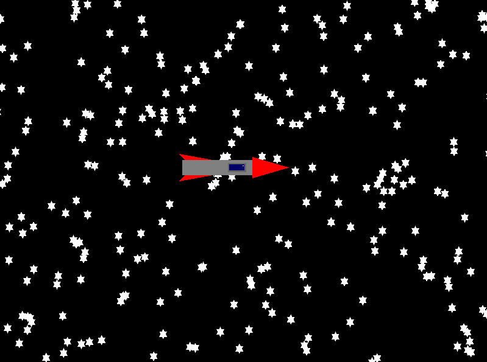

# Abstract Spaceship
În acest proiect am dezvoltat o simplă aplicație în care se poate vedea o rachetă care zboară în spațiu la infinit:



# Cum funcționează per ansamblu? 
Ne folosim de 3 shadere, unul din ele este pentru rachetă(shader-ul este trivial, racheta este compusă doar din primitive), unul este pentru fundal(pentru stele), iar cel de-al treilea pentru flăcările rachetei. Pentru a desena stele la infinit ne folosim de același shader de 2 ori, schimbând pentru fiecare shader în parte translația, care este transmisă ca uniform. Când o tranlsație ajunge să fie îndeajuns de mult în afara ferestrei de vizualizare îi schimbăm translația înapoi cum era la început:
```cpp
float translations[2] = { width * -4.0f, 0.0f };
constexpr float translate_offset = 250.0f;
float const translation_threshold = 4.0f * width;

// În render loop:
translations[i] = translations[i] + translate_offset * elapsed.count();
if(translations[i] >= translation_threshold) {
    translations[i] = -4.0f * width;
}
```
`elapsed` se referă la timpul care a trecut de la ultima randare, în secunde(este un float). Scopul lui este de a realiza mișcarea lină.

Stelelor le mai aplicăm și o scalare, pe care o transmitem tot ca un uniform, pentru a le face un pic mai realiste:
```cpp
float scalef = 1.0f;
constexpr float scale_lower_limit = 0.8f;
constexpr float scale_upper_limit = 1.2f;
float scale_offset = 0.5f;

// În render loop:
scalef = scalef + scale_offset * elapsed.count();
if((scalef < scale_lower_limit) || (scalef > scale_upper_limit)) {
    scale_offset = -scale_offset;
}
```
Stelele sunt generate random în 2 buffere, fiecare într-un dreptunghi `[-2 * width, 2 * width]`, de înălțime `height`:
```cpp
std::mt19937 rng{ std::random_device{}() };
std::uniform_real_distribution<float> x{ width * -2.0f, width * 2.0f };
std::uniform_real_distribution<float> y{ height * -1.0f, height * 1.0f };

for(int i = 0; i < num_stars; ++i) {
    auto star = generate_star(glm::vec2{ x(rng), y(rng) }, 200.0f);

    for(auto const f : star) {
        result.second.push_back(f);
    }

    star = generate_star(glm::vec2{ x(rng), y(rng) }, 200.0f);
    for(auto const f : star) {
        result.first.push_back(f);
    }
}
```
Stelele în sine conțin 2 triunghiuri intercalate, unul fiind oglinda celuilalt pe orizontală:
\newpage
```cpp
auto generate_star(glm::vec2 center, float const width, float const offset = 60.0f)
    -> std::array<float, floats_per_star>
{
    return std::array<float, floats_per_star>{ {
        center.x - 200.0f, center.y + 200.0f - offset,
            0.0f, 1.0f, center.x, center.y,
        center.x,          center.y - 200.0f - offset,
            0.0f, 1.0f, center.x, center.y,
        center.x + 200.0f, center.y + 200.0f - offset,
            0.0f, 1.0f, center.x, center.y,

        center.x - 200.0f, center.y - 200.0f + offset,
            0.0f, 1.0f, center.x, center.y,
        center.x,          center.y + 200.0f + offset,
            0.0f, 1.0f, center.x, center.y,
        center.x + 200.0f, center.y - 200.0f + offset,
            0.0f, 1.0f, center.x, center.y,
    } };
}
```

Pentru rachetă am încercat să adăugăm efectul de flăcări prin desenarea mai multor texturi similare rapid, dând impresia de animație. Din păcate am rămas blocați la încărcarea unei texturi.

Am început cu alegerea unui `.PNG`, noi l-am ales pe [0]. Am încercat să îl încărcăm cu `stb_image` [1], l-am încărcat cu succes dar nu putem afișa textura în sine:
```cpp
glGenTextures(1, &flame.texture);
glBindTexture(GL_TEXTURE_2D, flame.texture);

int flame_width, flame_height, nrChannels;
unsigned char* data = stbi_load("RocketFlames.png",
    &flame_width, &flame_height, &nrChannels, 0);

if(data) {
    glTexImage2D(GL_TEXTURE_2D, 0,
      GL_RGBA, flame_width, flame_height,
      0, GL_RGBA, GL_UNSIGNED_BYTE, data);
}
else {
    std::cout << "Failed to load texture" << std::endl;
}
stbi_image_free(data);
```
Codul pentru încărcarea texturilor este adaptat din [2].

\newpage
# Contribuțiile individuale
Alexandru-Gabriel Ică:

- Background-ul: stelele și mișcarea lor
- Documentația

Roxana-Ioana Gherghina:

- Racheta
- Texturile pentru flăcări

# Bibliografie
[0] Adobe Stock: https://stock.adobe.com/search?k=sprite+fire&asset_id=314670156

[1] `stb_image`: https://github.com/nothings/stb/blob/master/stb_image.h

[2] Learn OpenGL, "Textures": https://learnopengl.com/Getting-started/Textures

Ne-am mai folosit și de resursele de laborator din cadrul cursului.

# Anexe

- `main.cpp`:
```cpp
#include <cstdlib>
#include <cstdio>
#include <iostream>
#include <array>
#include <type_traits>
#include <vector>
#include <random>
#include <utility>
#include <chrono>

#include <GL/glew.h>
#include <GL/freeglut.h>

#include "glm/glm.hpp"
#include "glm/gtc/matrix_transform.hpp"
#include "glm/gtx/transform.hpp"
#include "glm/gtc/type_ptr.hpp"

#include "load_shaders.hpp"

#define STB_IMAGE_IMPLEMENTATION
#include "stb_loader.h"

GLuint codColLocation, myMatrixLocation;

glm::mat4 myMatrix, resizeMatrix, starMatrix;

int codCol;
int width = 800, height = 600;

struct spaceship_desc
{
    GLuint vao = 0;
    GLuint vertex_buffer_id = 0;
    GLuint color_buffer_id = 0;
    GLuint program_id = 0;
} spaceship;

struct flames_desc
{
    GLuint vao = 0;
    GLuint vertex_buffer_id = 0;
    GLuint texture = 0;
    GLuint program_id = 0;
} flame;

struct background_desc
{
    GLuint vao = 0;
    GLuint vertex_buffer_id = 0;
    GLuint program_id = 0;
} background[2];

constexpr int num_stars = 500;
constexpr int vertices_per_star = 6;
constexpr int floats_per_star = 36;
constexpr float star_scale_factor = 1.f / 20.f;

auto generate_star(glm::vec2 center, float const width, float const offset = 60.0f)
    -> std::array<float, floats_per_star>
{
    // clang-format off
    return std::array<float, floats_per_star>{ {
        center.x - 200.0f, center.y + 200.0f - offset,
           0.0f, 1.0f, center.x, center.y,
        center.x,          center.y - 200.0f - offset,
           0.0f, 1.0f, center.x, center.y,
        center.x + 200.0f, center.y + 200.0f - offset,
           0.0f, 1.0f, center.x, center.y,

        center.x - 200.0f, center.y - 200.0f + offset,
           0.0f, 1.0f, center.x, center.y,
        center.x,          center.y + 200.0f + offset,
           0.0f, 1.0f, center.x, center.y,
        center.x + 200.0f, center.y - 200.0f + offset,
           0.0f, 1.0f, center.x, center.y,
    } };
    // clang-format on
}

auto generate_background() -> std::pair<std::vector<float>, std::vector<float>>
{
    std::pair<std::vector<float>, std::vector<float>> result;
    result.first.reserve(num_stars * floats_per_star);
    result.second.reserve(num_stars * floats_per_star);

    std::mt19937 rng{ std::random_device{}() };
    std::uniform_real_distribution<float> x{
        width * -2.0f, width * 2.0f
    };
    std::uniform_real_distribution<float> y{
        height * -1.0f, height * 1.0f
    };

    for(int i = 0; i < num_stars; ++i) {
        auto star = generate_star(glm::vec2{ x(rng), y(rng) }, 200.0f);

        for(auto const f : star) {
            result.second.push_back(f);
        }

        star = generate_star(glm::vec2{ x(rng), y(rng) }, 200.0f);
        for(auto const f : star) {
            result.first.push_back(f);
        }
    }

    return result;
}

auto create_vbo() -> void
{
    // clang-format off
    GLfloat Vertices[] = {
        //spaceship body
        -200.0f, 20.0f, 0.0f, 1.0f,
        50.0f, 20.0f, 0.0f, 1.0f,
        50.0f, 70.0f, 0.0f, 1.0f,
        -200.0f, 70.0f, 0.0f, 1.0f,

        //spaceship tip
        30.0f, 10.0f, 0.0f, 1.0f,
        150.0f, 45.0f, 0.0f, 1.0f,
        30.0f, 80.0f, 0.0f, 1.0f,

        //spaceship wing1
        -210.0f, 0.0f, 0.0f, 1.0f,
        -100.0f, 20.0f, 0.0f, 1.0f,
        -190.0f, 20.0f, 0.0f, 1.0f,

        //spaceship wing2
        -190.0f, 70.0f, 0.0f, 1.0f,
        -100.0f, 70.0f, 0.0f, 1.0f,
        -210.0f, 90.0f, 0.0f, 1.0f,

        //spaceship window background
        -50.0f, 30.0f, 0.0f, 1.0f,
        10.0f, 30.0f, 0.0f, 1.0f,
        10.0f, 60.0f, 0.0f, 1.0f,
        -50.0f, 60.0f, 0.0f, 1.0f,

        //spaceship window
        -45.0f, 35.0f, 0.0f, 1.0f,
        5.0f, 35.0f, 0.0f, 1.0f,
        5.0f, 55.0f, 0.0f, 1.0f,
        -45.0f, 55.0f, 0.0f, 1.0f,

        //spaceship window sparkle
        -1.0f, 50.0f, 0.0f, 1.0f,
        2.0f, 50.0f, 0.0f, 1.0f,
        2.0f, 52.0f, 0.0f, 1.0f,
        -1.0f, 52.0f, 0.0f, 1.0f,
    };

    GLfloat Colors[] = {
        //spaceship body color
        0.5f, 0.5f, 0.5f, 1.0f,
        0.5f, 0.5f, 0.5f, 1.0f,
        0.5f, 0.5f, 0.5f, 1.0f,
        0.5f, 0.5f, 0.5f, 1.0f,

        //spaceship tip color
        1.0f, 0.0f, 0.0f, 1.0f,
        1.0f, 0.0f, 0.0f, 1.0f,
        1.0f, 0.0f, 0.0f, 1.0f,

        //spaceship wing1 color
        1.0f, 0.0f, 0.0f, 1.0f,
        1.0f, 0.0f, 0.0f, 1.0f,
        1.0f, 0.0f, 0.0f, 1.0f,

        //spaceship wing2 color
        1.0f, 0.0f, 0.0f, 1.0f,
        1.0f, 0.0f, 0.0f, 1.0f,
        1.0f, 0.0f, 0.0f, 1.0f,

        //spaceship window background color
        0.4f, 0.4f, 0.4f, 1.0f,
        0.4f, 0.4f, 0.4f, 1.0f,
        0.4f, 0.4f, 0.4f, 1.0f,
        0.4f, 0.4f, 0.4f, 1.0f,

        //spaceship window color
        0.0f, 0.0f, 0.4f, 1.0f,
        0.0f, 0.0f, 0.4f, 1.0f,
        0.0f, 0.0f, 0.4f, 1.0f,
        0.0f, 0.0f, 0.4f, 1.0f,

        //spaceship window sparkle color
        1.0f, 1.0f, 1.0f, 1.0f,
        1.0f, 1.0f, 1.0f, 1.0f,
        1.0f, 1.0f, 1.0f, 1.0f,
        1.0f, 1.0f, 1.0f, 1.0f,
    };
    // clang-format on

    glGenVertexArrays(1, &spaceship.vao);
    glBindVertexArray(spaceship.vao);

    glGenBuffers(1, &spaceship.vertex_buffer_id);
    glBindBuffer(GL_ARRAY_BUFFER, spaceship.vertex_buffer_id);
    glBufferData(GL_ARRAY_BUFFER, sizeof(Vertices), Vertices, GL_STATIC_DRAW);

    glEnableVertexAttribArray(0);
    glVertexAttribPointer(0, 4, GL_FLOAT, GL_FALSE, 0, 0);

    glGenBuffers(1, &spaceship.color_buffer_id);
    glBindBuffer(GL_ARRAY_BUFFER, spaceship.color_buffer_id);
    glBufferData(GL_ARRAY_BUFFER, sizeof(Colors), Colors, GL_STATIC_DRAW);

    glEnableVertexAttribArray(1);
    glVertexAttribPointer(1, 4, GL_FLOAT, GL_FALSE, 0, 0);

    GLfloat Vertices_Flame[] = {
        // spaceship flame
        -275.0f, 20.0f, 0.0f, 1.0f,    0.0f,
           0.0f, -200.0f, 20.0f, 0.0f,
        1.0f,    1.0f,  0.0f, -200.0f, 70.0f,
           0.0f, 1.0f,    1.0f,  1.0f,

        -200.0f, 70.0f, 0.0f, 1.0f,    1.0f,
           1.0f, -275.0f, 70.0f, 0.0f,
        1.0f,    0.0f,  1.0f, -275.0f, 20.0f,
           0.0f, 1.0f,    0.0f,  0.0f,
    };

    glEnable(GL_TEXTURE_2D);

    glGenTextures(1, &flame.texture);
    glBindTexture(GL_TEXTURE_2D, flame.texture);
    // set the texture wrapping/filtering options (on the currently bound texture object)
    glTexParameteri(GL_TEXTURE_2D, GL_TEXTURE_WRAP_S, GL_REPEAT);
    glTexParameteri(GL_TEXTURE_2D, GL_TEXTURE_WRAP_T, GL_REPEAT);
    glTexParameteri(GL_TEXTURE_2D, GL_TEXTURE_MIN_FILTER, GL_NEAREST);
    glTexParameteri(GL_TEXTURE_2D, GL_TEXTURE_MAG_FILTER, GL_LINEAR);

    int flame_width, flame_height, nrChannels;
    unsigned char* data = stbi_load("RocketFlames.png",
        &flame_width, &flame_height, &nrChannels, 0);

    std::cout << nrChannels;
    if(data) {
        glTexImage2D(GL_TEXTURE_2D, 0, GL_RGBA, flame_width, flame_height, 0, GL_RGBA, GL_UNSIGNED_BYTE, data);
        // glGenerateMipmap(GL_TEXTURE_2D);
    }
    else {
        std::cout << "Failed to load texture" << std::endl;
    }
    stbi_image_free(data);

    glGenVertexArrays(1, &flame.vao);
    glBindVertexArray(flame.vao);

    glGenBuffers(1, &flame.vertex_buffer_id);
    glBindBuffer(GL_ARRAY_BUFFER, flame.vertex_buffer_id);
    glBufferData(GL_ARRAY_BUFFER, sizeof(Vertices_Flame), Vertices_Flame, GL_STATIC_DRAW);

    glVertexAttribPointer(10, 4, GL_FLOAT,
        GL_FALSE, 6 * sizeof(float), 0);
    glEnableVertexAttribArray(10);

    glVertexAttribPointer(11, 2, GL_FLOAT,
        GL_FALSE, 6 * sizeof(float), (void*)(4 * sizeof(float)));
    glEnableVertexAttribArray(11);

    // background
    auto const [left_background_verts, right_background_verts]
        = generate_background();

    glGenVertexArrays(1, &background[0].vao);
    glBindVertexArray(background[0].vao);

    glGenBuffers(1, &background[0].vertex_buffer_id);
    glBindBuffer(GL_ARRAY_BUFFER, background[0].vertex_buffer_id);
    glBufferData(GL_ARRAY_BUFFER,
        right_background_verts.size() * sizeof(float),
        right_background_verts.data(), GL_STATIC_DRAW);

    glEnableVertexAttribArray(2);
    glVertexAttribPointer(2, 4, GL_FLOAT,
        GL_FALSE, 6 * sizeof(float), 0);

    glEnableVertexAttribArray(3);
    glVertexAttribPointer(3, 2, GL_FLOAT,
        GL_FALSE, 6 * sizeof(float),
        (void*)(4 * sizeof(float)));

    glGenVertexArrays(1, &background[1].vao);
    glBindVertexArray(background[1].vao);

    glGenBuffers(1, &background[1].vertex_buffer_id);
    glBindBuffer(GL_ARRAY_BUFFER, background[1].vertex_buffer_id);
    glBufferData(GL_ARRAY_BUFFER,
        left_background_verts.size() * sizeof(float),
        left_background_verts.data(), GL_STATIC_DRAW);

    glEnableVertexAttribArray(2);
    glVertexAttribPointer(2, 4, GL_FLOAT,
        GL_FALSE, 6 * sizeof(float), 0);

    glEnableVertexAttribArray(3);
    glVertexAttribPointer(3, 2, GL_FLOAT,
        GL_FALSE, 6 * sizeof(float), (void*)(4 * sizeof(float)));
}

auto destroy_vbo() -> void
{
    glDisableVertexAttribArray(3);
    glDisableVertexAttribArray(2);
    glDisableVertexAttribArray(1);
    glDisableVertexAttribArray(0);
    glDisableVertexAttribArray(10);
    glDisableVertexAttribArray(11);

    glBindBuffer(GL_ARRAY_BUFFER, 0);
    glDeleteBuffers(1, &spaceship.color_buffer_id);
    glDeleteBuffers(1, &spaceship.vertex_buffer_id);
    glDeleteBuffers(1, &background[0].vertex_buffer_id);
    glDeleteBuffers(1, &flame.vertex_buffer_id);

    glBindVertexArray(0);
    glDeleteVertexArrays(1, &spaceship.vao);
    glDeleteVertexArrays(1, &background[0].vao);
    glDeleteVertexArrays(1, &flame.vao);
}

auto create_shaders() -> void
{
    spaceship.program_id =
      load_shaders("spaceship_shader.vert", "spaceship_shader.frag");
    background[0].program_id =
      load_shaders("background_shader.vert", "background_shader.frag");
    background[1].program_id = background[0].program_id;
    flame.program_id =
      load_shaders("flames_shader.vert", "flames_shader.frag");
}

auto destroy_shaders() -> void
{
    glDeleteProgram(spaceship.program_id);
    glDeleteProgram(background[0].program_id);
    glDeleteProgram(flame.program_id);
}

auto initialize() -> void
{
    myMatrix = glm::mat4(1.0f);
    resizeMatrix = glm::scale(glm::mat4(1.0f),
        glm::vec3(1.f / width, 1.f / height, 1.0f));
    starMatrix = glm::scale(glm::mat4(1.0f), glm::vec3(star_scale_factor, star_scale_factor, 1.0f));

    glClearColor(0.0f, 0.0f, 0.0f, 1.0f);
    create_vbo();
    create_shaders();
}

using std::chrono::time_point;
using std::chrono::steady_clock;
using std::chrono::duration_cast;
using std::chrono::duration;
using std::chrono::seconds;

time_point<steady_clock> start_time = steady_clock::now();

float scalef = 1.0f;
constexpr float scale_lower_limit = 0.8f;
constexpr float scale_upper_limit = 1.2f;
float scale_offset = 0.5f;

float translations[2] = { width * -4.0f, 0.0f };
constexpr float translate_offset = 250.0f;
float const translation_threshold = 4.0f * width;

auto render_function() -> void
{
    auto const end_time = steady_clock::now();
    duration<float> elapsed = end_time - start_time;
    start_time = end_time;
    auto const duration = duration_cast<seconds>(elapsed).count();

    glClear(GL_COLOR_BUFFER_BIT);

    scalef = scalef + scale_offset * elapsed.count();
    if((scalef < scale_lower_limit) || (scalef > scale_upper_limit)) {
        scale_offset = -scale_offset;
    }

    myMatrix = resizeMatrix;

    for(int i = 0; i < 2; ++i) {
        translations[i] = translations[i] + translate_offset * elapsed.count();
        if(translations[i] >= translation_threshold) {
            translations[i] = -4.0f * width;
        }

        glBindVertexArray(background[i].vao);
        glUseProgram(background[i].program_id);

        myMatrixLocation = glGetUniformLocation(background[i].program_id, "myMatrix");
        glUniformMatrix4fv(myMatrixLocation, 1,
            GL_FALSE, &myMatrix[0][0]);

        myMatrixLocation = glGetUniformLocation(background[i].program_id, "starMatrix");
        glUniformMatrix4fv(myMatrixLocation, 1,
            GL_FALSE, &starMatrix[0][0]);

        myMatrixLocation = glGetUniformLocation(
            background[i].program_id, "additionalScale");
        glUniform1f(myMatrixLocation, scalef);

        myMatrixLocation = glGetUniformLocation(
            background[i].program_id, "translate");
        glUniform1f(myMatrixLocation, translations[i]);

        glDrawArrays(GL_TRIANGLES, 0, num_stars * vertices_per_star);
    }

    // SPACESHIP:

    glBindVertexArray(spaceship.vao);
    glUseProgram(spaceship.program_id);

    myMatrixLocation = glGetUniformLocation(
        spaceship.program_id, "myMatrix");
    glUniformMatrix4fv(myMatrixLocation, 1, GL_FALSE, &myMatrix[0][0]);

    codCol = 0;
    codColLocation = glGetUniformLocation(
        spaceship.program_id, "codCol");
    glUniform1i(codColLocation, codCol);

    glPointSize(10.0);

    glDrawArrays(GL_POLYGON, 0, 4);
    glDrawArrays(GL_TRIANGLES, 4, 3);
    glDrawArrays(GL_TRIANGLES, 7, 3);
    glDrawArrays(GL_TRIANGLES, 10, 3);
    glDrawArrays(GL_POLYGON, 13, 4);
    glDrawArrays(GL_POLYGON, 17, 4);
    glDrawArrays(GL_POLYGON, 21, 4);
    // glDrawArrays(GL_TRIANGLES, 25, 6);

    glActiveTexture(GL_TEXTURE0);
    glBindTexture(GL_TEXTURE_2D, flame.texture);

    glBindVertexArray(flame.vao);
    glUseProgram(flame.program_id);

    glUniform1i(glGetUniformLocation(flame.program_id, "ourTexture"), 0);

    glDrawArrays(GL_TRIANGLES, 0, 6);

    glutPostRedisplay();
    glFlush();
}

auto cleanup() -> void
{
    destroy_shaders();
    destroy_vbo();
}

auto resize(int const w, int const h) -> void
{
    width = w;
    height = h;
    resizeMatrix = glm::scale(glm::mat4(1.0f),
        glm::vec3(1.f / width, 1.f / height, 1.0));
}

auto main(int argc, char* argv[]) -> int
{
    glutInit(&argc, argv);
    glutInitDisplayMode(GLUT_SINGLE | GLUT_RGB);
    glutInitWindowPosition(100, 100);
    glutInitWindowSize(width, height);
    glutCreateWindow("Spaceship Project");
    glewInit();
    initialize();
    glutDisplayFunc(&render_function);
    glutCloseFunc(&cleanup);
    glutReshapeFunc(&resize);
    glutMainLoop();
}
```

- `background_shader.vert`:
```cpp
#version 400

layout(location = 2) in vec4 in_Position;
layout(location = 3) in vec2 in_Center;

out vec4 ex_Color;
uniform mat4 myMatrix;
uniform mat4 starMatrix;
uniform float additionalScale;
uniform float translate;
 
void main(void)
{
    vec4 at_center = vec4(in_Position.xy - in_Center, in_Position.zw);
    at_center = starMatrix * at_center;
    at_center.x *= additionalScale;
    at_center.y *= additionalScale;
    at_center = vec4(at_center.xy + in_Center.xy, at_center.zw);

    gl_Position = myMatrix * (at_center - vec4(translate, 0.0, 0.0, 0.0));
    ex_Color = vec4(1.0);
}
```

- `background_shader.frag`:
```cpp
#version 400

in vec4 ex_Color;

out vec4 out_Color;

void main(void)
{
    out_Color = ex_Color;
}
```

- `spaceship_shader.vert`:
```cpp
#version 400

layout(location = 0) in vec4 in_Position;
layout(location = 1) in vec4 in_Color;

out vec4 ex_Color;
uniform mat4 myMatrix;
 
void main(void)
{
    gl_Position = myMatrix * in_Position;
    ex_Color = in_Color;
}
```

- `spaceship_shader.frag`:
```cpp
#version 400

in vec4 ex_Color;

out vec4 out_Color;

void main(void)
{
    out_Color = ex_Color;
}
```

- `flames_shader.vert`:
```cpp
#version 400

layout (location = 10) in vec4 aPos;
layout (location = 11) in vec2 aTexCoord;

out vec2 TexCoord;

void main()
{
    gl_Position = aPos;
    TexCoord = aTexCoord;
}
```

- `flames_shader.frag`:
```cpp
#version 400

out vec4 FragColor;
in vec2 TexCoord;

uniform sampler2D ourTexture;

void main()
{
    FragColor = texture(ourTexture, TexCoord);
}
```

- `load_shaders.cpp`:
```cpp
#include "load_shaders.hpp"

#include <string_view>
#include <string>
#include <sstream>
#include <iostream>
#include <fstream>

enum class shader_type
{
    vertex = GL_VERTEX_SHADER,
    fragment = GL_FRAGMENT_SHADER,
};

auto load_whole_file(std::string_view path) -> std::string
{
    std::ifstream f{ path.data() };
    std::stringstream result{};
    std::string line{};

    while(std::getline(f, line)) {
        result << line << '\n';
    }

    return result.str();
}

auto load_shader_type(std::string_view path, shader_type type) -> GLuint
{
    std::string const src = load_whole_file(path);
    const char* source = src.c_str();

    GLuint shader_id = glCreateShader(static_cast<int>(type));
    GLint success = GL_FALSE;

    glShaderSource(shader_id, 1, &source, nullptr);
    glCompileShader(shader_id);
    glGetShaderiv(shader_id, GL_COMPILE_STATUS, &success);

    if(success == 0) {
        int length = 0;
        std::string msg;
        const char* shader_str = type == shader_type::vertex ? "vertex" : "fragment";

        glGetShaderiv(shader_id, GL_INFO_LOG_LENGTH, &length);
        msg.resize(static_cast<std::size_t>(length));
        glGetShaderInfoLog(shader_id, length, nullptr, msg.data());
        std::cerr << "Could not compile " << shader_str << " shader: " << msg << std::endl;
    }

    return shader_id;
}

auto load_shaders(const char* vertex_file_path, const char* fragment_file_path) -> GLuint
{
    GLuint program_id = glCreateProgram();

    GLuint vs = load_shader_type(vertex_file_path, shader_type::vertex);
    GLuint fs = load_shader_type(fragment_file_path, shader_type::fragment);

    glAttachShader(program_id, vs);
    glAttachShader(program_id, fs);
    glLinkProgram(program_id);

    int success = 0;
    glGetProgramiv(program_id, GL_LINK_STATUS, &success);

    if(success == 0) {
        std::string msg;
        int length = 0;

        glGetProgramiv(program_id, GL_INFO_LOG_LENGTH, &length);
        msg.resize(static_cast<std::size_t>(length));

        glGetProgramInfoLog(program_id, length, nullptr, msg.data());
        std::cerr << "Couldn't link shader program: " << msg << std::endl;
    }

    glDeleteShader(vs);
    glDeleteShader(fs);

    return program_id;
}
```

- `load_shader.hpp`:
```cpp
#ifndef LOAD_SHADERS_HPP
#define LOAD_SHADERS_HPP

#include <GL/glew.h>

auto load_shaders(const char* vertex_file_path, const char* fragment_file_path) -> GLuint;

#endif // !LOAD_SHADERS_HPP
```